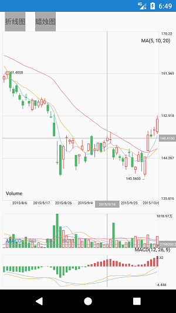

## Features
  
  1.增加实时缩放，缩放点在两指之间
  
  2.增加highlightStyle可以配置参数
  
  3.增加折线图联动及其切换
  
  4.增加高亮线聚焦
  
  5.修复已知闪退bug


## Screenshot

        

## fork

原开源项目：[https://github.com/wordplat/ikvStockChart]

## License

```java
/*
 * Copyright (C) 2017 WordPlat Open Source Project
 *
 *      https://wordplat.com/InteractiveKLineView/
 *
 * Licensed under the Apache License, Version 2.0 (the "License");
 * you may not use this file except in compliance with the License.
 * You may obtain a copy of the License at
 *
 *      http://www.apache.org/licenses/LICENSE-2.0
 *
 * Unless required by applicable law or agreed to in writing, software
 * distributed under the License is distributed on an "AS IS" BASIS,
 * WITHOUT WARRANTIES OR CONDITIONS OF ANY KIND, either express or implied.
 * See the License for the specific language governing permissions and
 * limitations under the License.
 */
```